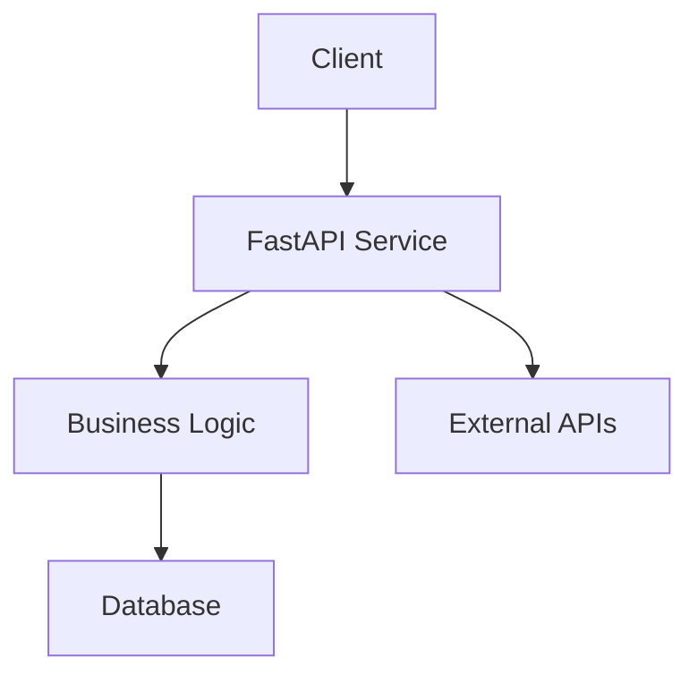

# Python Service Documentation

Welcome to the Python Service documentation. This service is a sample microservice built with FastAPI that demonstrates modern Python development practices.

## Overview

The Python Service is designed to showcase:

- **RESTful API Design**: Clean and intuitive REST endpoints
- **Modern Python**: Built with Python 3.9+ and modern libraries
- **Documentation**: Comprehensive docs with MkDocs
- **Testing**: Full test coverage with pytest
- **Service Catalog**: Integration with Backstage service catalog

## Architecture

## Key Features

- ✅ Health check endpoints
- ✅ CRUD operations for items
- ✅ Request validation
- ✅ Error handling
- ✅ Logging and monitoring
- ✅ API documentation with OpenAPI/Swagger

## Quick Links

- [Getting Started](getting-started.md) - Set up the development environment
- [API Reference](api-reference.md) - Complete API documentation
- [Development](development.md) - Development workflow and guidelines
- [Deployment](deployment.md) - Deployment instructions
- [Contributing](contributing.md) - How to contribute to this project

## Technology Stack

| Component | Technology |
|-----------|------------|
| Language | Python 3.9+ |
| Web Framework | FastAPI |
| Testing | pytest |
| Documentation | MkDocs |
| Database | PostgreSQL |
| Container | Docker |

## Support

For questions or issues, please:

1. Check the [documentation](index.md)
2. Search existing [issues](https://github.com/your-org/python-service/issues)
3. Create a new issue if needed
